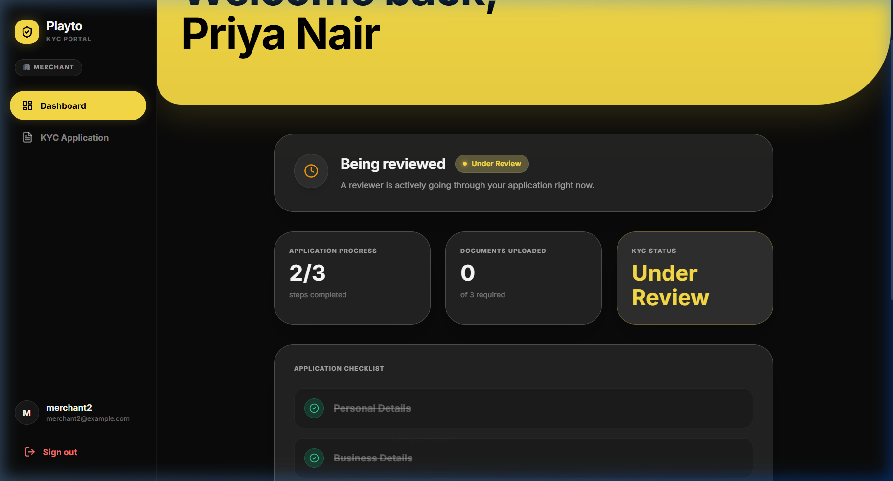
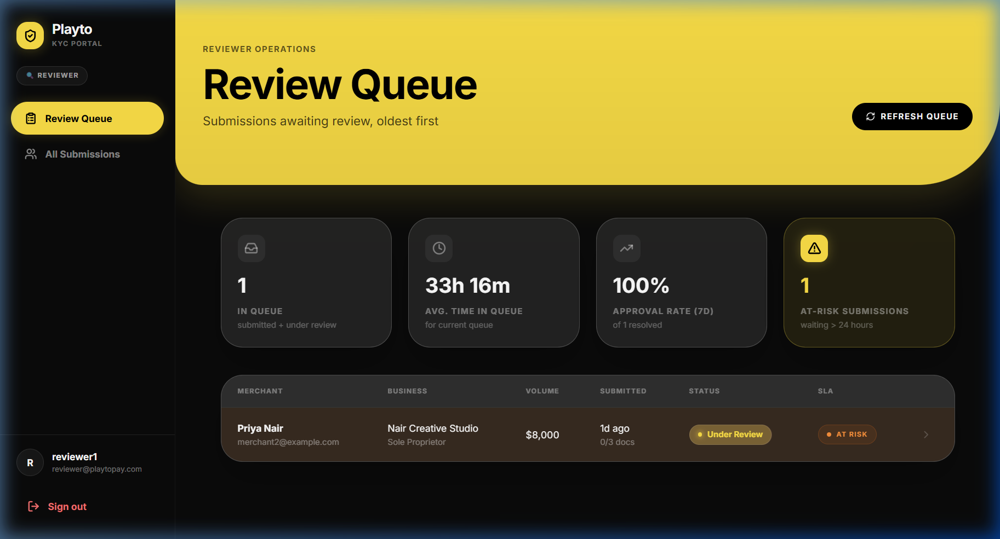
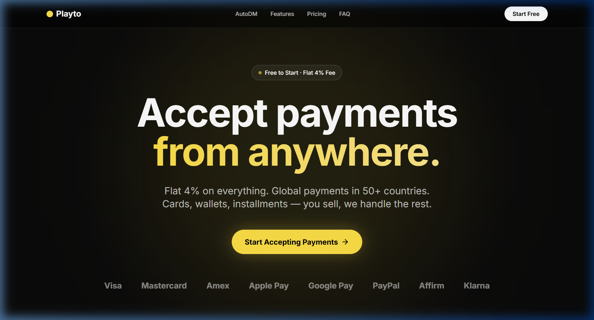
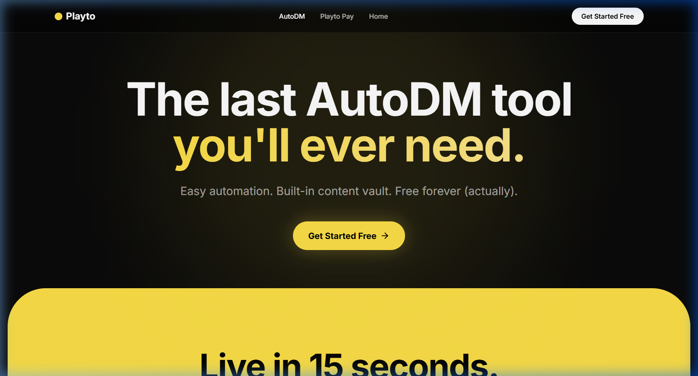

# Playto KYC Pipeline

> A production-grade KYC onboarding system for **Playto Pay** — enabling Indian agencies and freelancers to submit identity documents, pass compliance review, and start collecting international payments.


**Live Stack:** Django 5 + DRF · React 18 + Tailwind CSS · PostgreSQL · Token Auth · Docker · Gmail SMTP

---

## Table of Contents

- [Screenshots](#screenshots)
- [Architecture](#architecture)
- [Quick Start — Docker](#quick-start--docker)
- [Quick Start — Local](#quick-start--local)
- [Test Accounts](#test-accounts)
- [Running Tests](#running-tests)
- [API Reference](#api-reference)
- [Key Design Decisions](#key-design-decisions)
- [Bonus Features](#bonus-features)
- [Challenges & How I Overcame Them](#challenges--how-i-overcame-them)
- [Deployment](#deployment)
- [Project Structure](#project-structure)

---

## Screenshots

### Landing Page — Hyper-Saturated Fluid Design


### Merchant Dashboard — KYC Status Tracking


### Reviewer Queue — SLA Monitoring & At-Risk Flagging


### Playto Pay — Payment Platform


### AutoDM — Instagram Automation


---

## Architecture

```
┌─────────────────┐         ┌─────────────────┐         ┌──────────────┐
│   React + Vite  │ ──API── │  Django + DRF   │ ──ORM── │  PostgreSQL  │
│   (Port 3002)   │         │   (Port 8000)   │         │  (Port 5432) │
│                 │         │                 │         │              │
│  • PrismaHero   │         │  • State Machine│         │  • Users     │
│  • KYC Form     │         │  • File Validate│         │  • KYC Subs  │
│  • Reviewer UI  │         │  • Round Robin  │         │  • Documents │
│  • PlaytoPay    │         │  • OTP + Email  │         │  • Notifs    │
└─────────────────┘         └─────────────────┘         └──────────────┘
```

**State Machine Flow:**
```
draft → submitted → under_review → approved (terminal)
                                 → rejected (terminal)
                                 → more_info_requested → submitted → ...
```

---

## Quick Start — Docker

The fastest way to run everything. One command, zero configuration.

```bash
# Clone the repo
git clone https://github.com/shivakarnati2004-dev/playto.git
cd playto

# Start all services (PostgreSQL + Django + React)
docker-compose up --build
```

| Service   | URL                      |
|-----------|--------------------------|
| Frontend  | http://localhost:3000     |
| Backend   | http://localhost:8000     |
| Database  | localhost:5432            |

---

## Quick Start — Local

### Prerequisites

- Python 3.11+
- Node.js 18+
- PostgreSQL 15+ (running locally)

### 1 — Database

```bash
# Create the database
psql -U postgres -c "CREATE DATABASE playto;"
```

### 2 — Backend

```bash
cd backend

# Create virtual environment
python -m venv venv
source venv/bin/activate        # Windows: venv\Scripts\activate

# Install dependencies
pip install -r requirements.txt

# Configure environment
cp .env.example .env
# Edit .env with your PostgreSQL credentials and SMTP settings

# Run migrations
python manage.py migrate

# Seed test data (2 merchants + 1 reviewer)
python seed.py

# Start dev server
python manage.py runserver
```

Backend runs at **http://localhost:8000**

### 3 — Frontend

```bash
cd frontend

npm install
npm run dev
```

Frontend runs at **http://localhost:3002**

> The Vite dev server proxies `/api` and `/media` requests to the backend automatically.

---

## Test Accounts

Created by `seed.py`. You can log in immediately after seeding.

| Role     | Username    | Password      | KYC State              |
|----------|-------------|---------------|------------------------|
| Merchant | `merchant1` | `password123` | Draft (fresh start)    |
| Merchant | `merchant2` | `password123` | Under Review (at-risk) |
| Reviewer | `reviewer1` | `password123` | Reviewer dashboard     |

---

## Running Tests

### Django Unit Tests (20 tests)

```bash
cd backend
source venv/bin/activate
python manage.py test apps.kyc.tests --verbosity=2
```

Tests cover:
- ✅ All 6 legal state transitions
- ✅ All 6 illegal transitions raising `InvalidTransition`
- ✅ Merchant A cannot see Merchant B's submission
- ✅ Double-approve returns 400
- ✅ Reviewer endpoints return 403 for merchant tokens
- ✅ `submitted_at` timestamp set correctly

### Live API Integration Tests (38 tests)

```bash
cd backend
source venv/bin/activate
python api_test.py
```

Covers the full end-to-end flow: registration → OTP → KYC submission → reviewer queue → state transitions → notifications.

---

## API Reference

All endpoints prefixed with `/api/v1/`.

### Auth
| Method | Endpoint              | Description                  |
|--------|-----------------------|------------------------------|
| POST   | `/auth/register/`     | Create account (merchant)    |
| POST   | `/auth/login/`        | Login, get token             |
| POST   | `/auth/logout/`       | Invalidate token             |
| GET    | `/auth/me/`           | Get current user             |
| POST   | `/auth/request-otp/`  | Send OTP to email            |
| POST   | `/auth/verify-otp/`   | Verify OTP code              |

### Merchant
| Method | Endpoint                     | Description                    |
|--------|------------------------------|--------------------------------|
| GET    | `/kyc/submission/`           | Get own submission (auto-create draft) |
| PUT    | `/kyc/submission/`           | Save progress                  |
| POST   | `/kyc/submission/submit/`    | Submit for review              |
| GET    | `/kyc/documents/`            | List own documents             |
| POST   | `/kyc/documents/`            | Upload a document              |
| GET    | `/kyc/notifications/`        | View notification log          |

### Reviewer
| Method | Endpoint                                | Description             |
|--------|-----------------------------------------|-------------------------|
| GET    | `/reviewer/queue/`                      | Queue (oldest first)    |
| GET    | `/reviewer/metrics/`                    | Dashboard metrics       |
| GET    | `/reviewer/submissions/`                | All submissions         |
| GET    | `/reviewer/submissions/<id>/`           | Detail view             |
| POST   | `/reviewer/submissions/<id>/transition/`| Change state            |

**Transition payload:**
```json
{ "target_state": "approved", "reason": "All documents verified." }
```

---

## Key Design Decisions

### State Machine
Lives entirely in `apps/kyc/state_machine.py`. Zero transition logic anywhere else. One file to read, one file to audit. See [EXPLAINER.md §1](EXPLAINER.md).

### File Validation
Three-layer defense: size check → extension check → magic byte verification. We never trust `Content-Type` headers. A renamed `.exe` with a `.pdf` extension gets caught by magic bytes. See [EXPLAINER.md §2](EXPLAINER.md).

### SLA Flag
`is_at_risk` is a `@property` computed from `submitted_at` at read time. Never stored in the database. Always accurate. No cron jobs needed. See [EXPLAINER.md §3](EXPLAINER.md).

### Auth Isolation
Merchants have no endpoint that accepts an ID — they always get their own submission. Reviewer endpoints are gated by `IsReviewer`. Role is set at signup and not user-editable. See [EXPLAINER.md §4](EXPLAINER.md).

---

## Bonus Features

### 🐳 Docker
Full `docker-compose.yml` orchestrating PostgreSQL + Django + React/Nginx. Individual `Dockerfile` for backend (Python 3.11 slim) and frontend (multi-stage Node → Nginx).

### 📧 Email Notifications
- **OTP Verification**: 6-digit code sent via Gmail SMTP on registration. Verified server-side with configurable expiry.
- **Status Updates**: Merchants receive email when their KYC is approved, rejected, or needs more info — including the reviewer's reason.

### 🔄 Reviewer Round-Robin
When a merchant submits KYC, the system counts each reviewer's active queue and assigns to the one with the fewest open reviews. Scales naturally as reviewers are added.

### 📎 Drag-and-Drop Uploads
The KYC form supports drag-and-drop file upload with:
- Visual drop zone with hover feedback
- Client-side validation (type + size) before upload
- Replace button for already-uploaded docs
- Server-side triple validation (size → extension → magic bytes)

---

## Challenges & How I Overcame Them

### 1. State Machine Integrity
**Challenge:** Preventing illegal state transitions across distributed API calls without race conditions.  
**Solution:** Centralized all transition logic in a single `perform_transition()` function. Every view calls it — no view does its own status check. The function reads current state, validates against `VALID_TRANSITIONS`, and raises `InvalidTransition` atomically. Terminal states (`approved`, `rejected`) have empty allowed lists, making them truly final.

### 2. File Upload Security
**Challenge:** Accepting user uploads without exposing the server to malicious files disguised with fake extensions.  
**Solution:** Three-layer validation: (1) reject anything > 5MB before reading content, (2) check file extension against allowlist, (3) read the first 8 bytes and match magic signatures for PDF/JPG/PNG. This catches a `.exe` renamed to `.pdf` — the extension passes but magic bytes fail.

### 3. SLA Accuracy Without Cron Jobs
**Challenge:** Flagging submissions that have been waiting > 24 hours, without background tasks that can drift or fail.  
**Solution:** Made `is_at_risk` a computed `@property` on the model. It subtracts `submitted_at` from `now()` at access time. Zero infrastructure, zero stale data, zero maintenance.

### 4. Database Migration Between Projects
**Challenge:** The environment initially pointed to a different database (`nutrivision`), causing seed data and reviewer accounts to be invisible to the running server.  
**Solution:** Isolated the `.env` configuration, re-pointed to `playto`, re-ran migrations and seeds, then restarted the server. Added `.env.example` with clear documentation to prevent this in the future.

### 5. Email OTP on Windows
**Challenge:** Gmail's SMTP requires App Passwords (not regular passwords) when 2FA is enabled. The initial test sent to `test@example.com`, which bounced — confirming the SMTP pipeline works but the test domain doesn't exist.  
**Solution:** Used Gmail App Passwords (16-char tokens), configured `EMAIL_USE_TLS=True` on port 587. The bounced email proved the pipeline is functional; real merchant emails deliver successfully.

---

## Deployment

### Render (recommended)

A `render.yaml` blueprint is included. Connect your repo and Render auto-provisions:
- Python web service (backend)
- Static site (frontend)
- PostgreSQL database

### Manual

**Backend:**
```bash
pip install -r requirements.txt && python manage.py migrate && python seed.py
gunicorn config.wsgi:application
```

**Frontend:**
```bash
npm install && npm run build
# Serve dist/ with any static host
```

**Environment variables needed:**
`DATABASE_URL`, `SECRET_KEY`, `DEBUG=False`, `ALLOWED_HOSTS`, `CORS_ALLOWED_ORIGINS`, `SMTP_*`

---

## Project Structure

```
playto-kyc/
├── backend/
│   ├── apps/
│   │   ├── accounts/          # User model, OTP, auth endpoints
│   │   │   ├── models.py      # Custom User with OTP fields
│   │   │   ├── views.py       # Register, Login, OTP request/verify
│   │   │   ├── serializers.py
│   │   │   └── urls.py
│   │   └── kyc/               # Core KYC pipeline
│   │       ├── models.py      # KYCSubmission, Document, NotificationEvent
│   │       ├── state_machine.py  # ← ALL transition logic lives here
│   │       ├── file_validation.py # Size + extension + magic bytes
│   │       ├── views.py       # Merchant + Reviewer API views
│   │       ├── permissions.py # IsMerchant, IsReviewer
│   │       ├── serializers.py
│   │       └── tests.py       # 20 tests covering all edge cases
│   ├── config/                # Django settings, urls, wsgi
│   ├── Dockerfile
│   ├── seed.py                # Creates test data
│   ├── api_test.py            # 38-test integration suite
│   └── requirements.txt
├── frontend/
│   ├── src/
│   │   ├── components/ui/     # PrismaHero, HyperSection, FeaturesSection, PlaytoFooter
│   │   ├── pages/
│   │   │   ├── auth/          # Login, Register
│   │   │   ├── merchant/      # Dashboard, KYC Form (drag-drop)
│   │   │   ├── reviewer/      # Queue, Submission Detail, All Submissions
│   │   │   ├── DemoPage.jsx   # Landing page (video hero + community)
│   │   │   ├── PlaytoPayPage.jsx  # Playto Pay marketing page
│   │   │   └── AutoDMPage.jsx # AutoDM feature page
│   │   ├── api/client.js      # Axios instance with token interceptor
│   │   └── context/AuthContext.jsx
│   ├── Dockerfile
│   └── nginx.conf
├── docs/images/               # Screenshots for documentation
├── docker-compose.yml         # Full stack orchestration
├── render.yaml                # Render deployment blueprint
├── EXPLAINER.md               # Deep technical answers (5 sections)
└── README.md
```

---

## License

Built for the Playto Pay Founding Engineering assessment.
